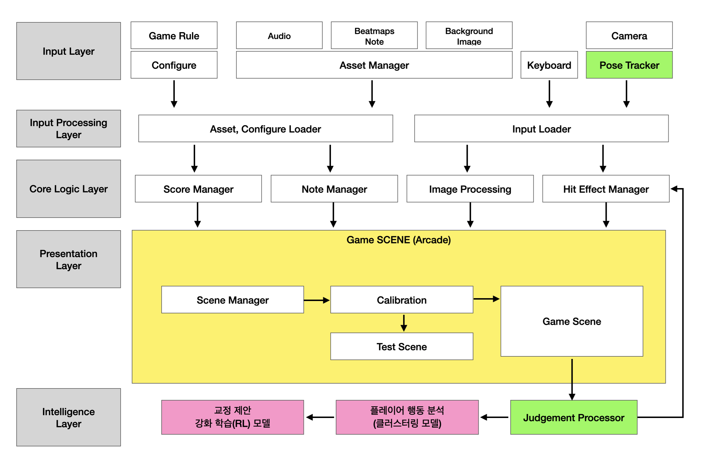

# Beat Boxer (v1.0)

Beat Boxer는 권투의 기술을 정확히 습득하고 타이밍 및 포즈를 유지하는 것에 중점을 둔 실시간 모션 인식 기반의 권투 리듬 게임입니다.
특히 어린이 사용자의 경우, 잘못된 자세가 습관이 되기 쉽기 때문에 정확한 포즈를 유지하는 것이 근육 발달과 부상 방지에 매우 중요합니다. 권투 포즈(가드 자세)는 코어 근육을 활용하고 균형 감각을 키우는 기초입니다. 본 게임은 사용자의 실제 신체 동작(정확한 펀치 궤적, 안정적인 회피 자세)을 카메라를 통해 실시간으로 감지하고 피드백을 제공합니다. 또한 플레이어의 행동 패턴을 분석하고 개인화된 교정을 제안하는 시스템입니다.


## 테스트 모드 영상 


## 게임 디자인 



## 🕹️ 주요 기능

* **실시간 모션 감지:** MediaPipe Pose를 통한 전신 랜드마크 추적 및 스무딩
* **실루엣 추출:** MediaPipe Selfie Segmentation을 활용한 실시간 인물 실루엣 외곽선 표시
* **동작 판정:** 펀치(좌/우 잽) 및 위빙(좌/우 회피) 동작 인식
* **리듬 게임 시스템:** 리듬 기반 비트맵(`beatmap.txt`)에 맞춰 노트 스폰 및 판정 (Perfect, Great, Good, Miss)
* **공간 + 타이밍 판정:** 손 랜드마크 위치와 타이밍을 모두 고려한 정확한 판정
* **히트 이펙트:** 판정 시 시각적 피드백 (파티클 시스템)
* **씬(Scene) 관리:** 메인 메뉴, 캘리브레이션, 게임 플레이, 결과 화면
* **전략 패턴:** 일반 모드와 테스트 모드를 Strategy 패턴으로 분리
* **설정 분리:** 게임 밸런스(`rules.json`), 난이도(`difficulty.json`), UI(`ui.json`)를 외부 파일로 분리
* **모듈화된 아키텍처:** 책임 분리된 컴포넌트 구조 (NoteManager, JudgmentProcessor, ScoreManager 등)

## 💻 사용된 기술 스택

* **Python 3.11+**
* **Arcade:** 2D 게임 엔진 및 렌더링
* **OpenCV:** 카메라 입출력 및 이미지 처리
* **MediaPipe:** 실시간 포즈 인식 및 세그멘테이션
* **Pygame:** 오디오 재생
* **NumPy:** 수치 계산 및 좌표 변환

---

## 🚀 설치 및 실행 방법

1. **Git 저장소 복제 (Clone)**
   ```bash
   git clone https://github.com/Jangsungtai/beat-boxer-game.git
   cd beat-boxer-game
   ```

2. **Conda 가상 환경 생성 및 활성화**
   ```bash
   # (Python 3.11 또는 3.12 권장)
   conda create -n beat_boxer_game python=3.11
   conda activate beat_boxer_game
   ```

3. **필요한 라이브러리 설치**
   ```bash
   pip install -r requirements.txt
   ```

4. **프로그램 실행**
   ```bash
   python main.py
   ```

### ⌨️ 조작 키

* **[전역]** `ESC` : 프로그램 즉시 종료
* **[메뉴]** `Spacebar` : 게임 시작
* **[캘리브레이션]** `0` : 캘리브레이션 스킵 (일반 모드)
* **[캘리브레이션]** `9` : 캘리브레이션 스킵 (테스트 모드)
* **[게임 중]** `T` : 테스트 모드 토글
* **[게임 중]** `M` : 메인 메뉴로
* **[결과]** `M` : 메인 메뉴로
* **[결과]** `Spacebar` : 게임 재시작

---

## 📂 폴더 구조

```
beat_boxer_game/
├── main.py                          # 프로그램 진입점
├── requirements.txt                  # Python 패키지 의존성
│
├── config/                          # 설정 파일 (JSON)
│   ├── rules.json                   # 게임 규칙 및 판정 설정
│   ├── difficulty.json              # 난이도별 설정 (BPM, 판정 시간)
│   └── ui.json                      # UI 색상, 위치, 스타일 설정
│
├── core/                            # 핵심 게임 로직
│   ├── audio_manager.py             # 오디오 관리 (사운드, 음악)
│   ├── beatmap_loader.py            # 비트맵 로딩 및 파싱
│   ├── config_manager.py            # 설정 파일 중앙 관리
│   ├── constants.py                 # 게임 상수 정의
│   ├── game_factory.py              # 게임 컴포넌트 생성 및 의존성 주입
│   ├── game_state.py                # 게임 상태 관리
│   ├── hit_effect.py                # 히트 이펙트 시스템
│   ├── judgment_logic.py            # 위빙 판정 로직
│   ├── judgment_processor.py        # 판정 처리 통합 관리
│   ├── judgment_strategy.py         # 판정 전략 패턴
│   ├── logger.py                    # 로깅 시스템
│   ├── note.py                      # 노트 객체 클래스
│   ├── note_manager.py              # 노트 생명주기 관리
│   ├── pose_tracker.py              # 포즈 추적 및 동작 감지
│   ├── score_manager.py             # 점수 및 콤보 관리
│   └── silhouette_renderer.py       # 실루엣 렌더링
│
├── scenes/                          # 게임 씬 관리
│   ├── base_scene.py                # 씬 기본 클래스
│   ├── calibration_scene.py        # 캘리브레이션 씬
│   ├── game_scene.py                # 게임 플레이 씬 (핵심)
│   ├── game_mode_strategy.py       # 전략 패턴 추상 클래스
│   ├── main_menu_scene.py           # 메인 메뉴 씬
│   ├── normal_mode_strategy.py      # 일반 모드 전략 구현
│   ├── result_scene.py              # 결과 화면 씬
│   └── test_mode_strategy.py        # 테스트 모드 전략 구현
│
└── assets/                          # 리소스 파일
    ├── beatmaps/                    # 비트맵 데이터
    │   └── song1/
    │       ├── beatmap.txt           # 텍스트 기반 비트맵
    │       ├── beatmap.json          # JSON 기반 비트맵
    │       └── music.mp3             # 배경 음악
    ├── sounds/                      # 효과음 파일
    └── images/                      # 이미지 리소스
        └── arena_bg.jpg             # 게임 배경 이미지
```

## 🎮 게임 모드

### 일반 모드 (Normal Mode)
- 기본 게임 플레이 모드
- 판정 결과 표시 (PERFECT, GREAT, GOOD, MISS)
- 히트존 색상 변경 (판정 결과에 따라)
- 실루엣 및 포즈 랜드마크 표시

### 테스트 모드 (Test Mode)
- 캘리브레이션 화면에서 `9` 키를 눌러 진입
- 일반 모드와 동일한 판정 로직
- 추가 디버그 정보 표시:
  - 판정 창 정보 (Perfect, Great, Good)
  - 게임 시간 및 활성 노트 수
  - 가장 가까운 노트 정보 및 시간 차이
  - 이벤트 히스토리
  - 판정 로그
- 히트존 색상 변경 (손이 히트존 안에 있으면 녹색, 아니면 빨간색)

## 🎯 노트 타입

* **JAB_L (왼쪽 잽):** 화면 왼쪽에서 중앙으로 이동하는 노트
* **JAB_R (오른쪽 잽):** 화면 오른쪽에서 중앙으로 이동하는 노트
* **WEAVE_L (왼쪽 위빙):** 왼쪽 레인에서 내려오는 노트 (코를 오른쪽으로 이동)
* **WEAVE_R (오른쪽 위빙):** 오른쪽 레인에서 내려오는 노트 (코를 왼쪽으로 이동)

## 📋 버전 관리

### v1.0 (2024-12)

**정식 릴리즈 버전**

#### 🏗️ 주요 리팩토링 (Phase 1-4)

**Phase 1: 기본 개선**
* 실루엣 렌더러 분리 (`core/silhouette_renderer.py`)
* MISS 처리 중복 제거 (`JudgmentProcessor`에 통합)
* 타입 힌트 보강

**Phase 2: GameScene 분리**
* `NoteManager`: 노트 스폰, 업데이트, 정리
* `JudgmentProcessor`: 판정 처리 통합
* `ScoreManager`: 점수 및 콤보 관리
* `BeatmapLoader`: 비트맵 로딩 및 파싱
* `ConfigManager`: 설정 중앙 관리
* 로깅 시스템 (`core/logger.py`)

**Phase 3: 아키텍처 개선**
* `GameState`: 상태 관리 개선 (데이터 클래스)
* `JudgmentStrategy`: 전략 패턴 확장
* `GameFactory`: 의존성 주입 개선

**Phase 4: 테스트 가능성**
* 인터페이스 분리
* 컴포넌트 독립성 향상
* `main.py` 리팩토링 (GameFactory 사용)

#### ✨ 새로운 기능
* **실루엣 표시:** MediaPipe Selfie Segmentation을 활용한 실시간 인물 실루엣 외곽선
* **위빙 노트:** 좌우 회피 동작을 위한 WEAVE_L/WEAVE_R 노트 타입 추가
* **히트 이펙트 시스템:** 판정 시 시각적 피드백 (파티클 시스템)
* **포즈 랜드마크 표시:** 게임 화면에서 실시간으로 포즈 랜드마크 표시
* **배경 이미지:** 게임 배경으로 `arena_bg.jpg` 사용
* **네온 효과:** Dodge 라인에 네온 글로우 효과 적용
* **캘리브레이션 스킵:** `0` 또는 `9` 키로 캘리브레이션 건너뛰기

#### 📝 개선 사항
* **코드 구조:** 모듈 책임 분리, 코드 중복 제거
* **GameScene 크기:** 779줄 → 약 520줄 (책임 분리)
* **유지보수성:** 각 모듈의 역할이 명확해짐
* **확장성:** 새로운 기능 추가가 쉬워짐
* **로깅:** 구조화된 로깅 시스템 도입
* **에러 처리:** 개선된 예외 처리 및 로깅

#### 🔧 기술적 개선
* **파일 구조 정리:** `constants.py`, `judgment_logic.py`를 `core/`로 이동
* **사용되지 않는 파일 제거:** `beat_manager.py`, `game_scene_old.py` 등
* **타입 힌트:** 전반적인 타입 힌트 보강
* **의존성 주입:** GameFactory를 통한 컴포넌트 생성

---

### v0.9 (2024-12)

**리팩토링 완료 버전**

#### 🏗️ 주요 리팩토링
* **Phase 1: PoseTracker 역할 확장**
  - 랜드마크 스무딩 및 주먹 중심점 계산을 `PoseTracker`로 이동
  - `GameScene` 코드 약 200줄 감소
  - `PoseTracker`가 포즈 관련 모든 데이터를 캡슐화

* **Phase 2: Strategy 패턴 재정립**
  - 공통 HUD 로직을 `GameModeStrategy`에 통합
  - `normal_mode_strategy`와 `test_mode_strategy`의 공통 로직 제거
  - Strategy 독립성 향상

* **Phase 3: BPM 연동 로직 개선**
  - 설정을 박자 단위로 변경 (`judge_timing_base_beats`, `pre_spawn_beats`)
  - BPM 변경 시 모든 타이밍이 자동으로 조정됨
  - 비선형 스케일링 로직 제거로 코드 단순화

* **Phase 4: 캘리브레이션 로직 이동**
  - 캘리브레이션 위치 확인 로직을 `PoseTracker`로 이동
  - 일관성 있는 모듈 구조 확보

#### ✨ 새로운 기능
* **BPM 동기화 비프음:** 400Hz 가이드 비프음이 BPM에 맞춰 자동 재생
* **박자 단위 설정:** `difficulty.json`에서 박자 단위로 설정 (BPM에 따라 자동 변환)
* **공간 판정 모드:** `spatial_judge_mode` 설정으로 손목만 또는 손 랜드마크 4개 + 주먹 중심 판정
* **판정 실패 이유 표시:** "timing", "area", "area/timing"으로 실패 원인 구분
* **히트존 색상 변경:** 판정 결과에 따라 히트존 색상 및 두께 변경

---

### v0.1a (2025-11-01)

* 최초 플레이 가능 빌드 (Alpha)
* `main` / `develop` / `feature` 브랜치 전략을 사용한 Git 형상관리 시작
* 씬 관리 시스템 도입 (메인 메뉴, 게임, 결과 화면)
* MediaPipe Pose 기반 펀치(Jab) / 더킹(Duck) 판정 로직 구현
* Pygame 오디오 및 BGM/SFX 연동 (`core/audio_manager.py`)
* `config` 폴더를 통한 핵심 설정값(규칙, 난이도, UI) 분리
* OpenCV `cv2.waitKey` 기반의 키 입력 시스템으로 안정화
* macOS 연속성 카메라(아이폰) 문제를 회피하는 카메라 인덱스 탐색 기능 추가

---

## 🎯 게임 플레이 가이드

### 캘리브레이션
1. 게임 시작 시 캘리브레이션 화면이 표시됩니다
2. 화면에 표시된 원 안에 머리와 양손을 맞춥니다
3. 모든 원이 채워지면 3초 카운트다운이 시작됩니다
4. 카운트다운이 끝나면 게임이 시작됩니다
5. `0` 키를 누르면 캘리브레이션을 건너뛰고 일반 모드로 시작합니다
6. `9` 키를 누르면 캘리브레이션을 건너뛰고 테스트 모드로 시작합니다

### 게임 플레이
* **JAB_L 노트:** 왼손으로 펀치 (화면 왼쪽에서 내려오는 노트)
* **JAB_R 노트:** 오른손으로 펀치 (화면 오른쪽에서 내려오는 노트)
* **WEAVE_L 노트:** 왼쪽으로 회피 (코를 오른쪽으로 이동)
* **WEAVE_R 노트:** 오른쪽으로 회피 (코를 왼쪽으로 이동)

### 판정 시스템
* **PERFECT:** 정확한 타이밍과 위치 (±0.08초, Easy 모드 기준)
* **GREAT:** 좋은 타이밍과 위치 (±0.18초, Easy 모드 기준)
* **GOOD:** 허용 가능한 타이밍과 위치 (±0.30초, Easy 모드 기준)
* **MISS:** 판정 창을 벗어남

---

## 🔧 설정 파일

### `config/difficulty.json`
난이도별 판정 타이밍 및 게임 설정:
```json
{
  "default": "Easy",
  "song_info": {
    "bpm": 30,
    "division": 4
  },
  "judge_timing_base": {
    "perfect": 0.08,
    "great": 0.18,
    "good": 0.30
  },
  "levels": {
    "Easy": {
      "pre_spawn_time": 1.5,
      "judge_timing_scale": 4.0,
      "score_multiplier": 0.8
    }
  }
}
```

### `config/rules.json`
게임 규칙 및 판정 설정:
* `action_thresholds`: 동작 감지 임계값
* `score_base`: 판정별 기본 점수
* `timing_offset`: 타이밍 오프셋

### `config/ui.json`
UI 색상, 위치, 스타일 설정:
* `colors`: 노트, 판정, HUD 색상
* `positions`: 히트존, 캘리브레이션 타겟 위치
* `styles`: 노트 크기, 히트존 반지름 등

---

## 📝 개발 노트

### 아키텍처 설계 원칙
* **단일 책임 원칙:** 각 모듈은 하나의 명확한 책임을 가짐
* **의존성 주입:** GameFactory를 통한 컴포넌트 생성
* **전략 패턴:** 게임 모드별 전략 분리
* **상태 관리:** GameState를 통한 중앙 집중식 상태 관리

### 확장 가능성
* 새로운 노트 타입 추가: `core/note.py`의 `_initial_position` 및 `type_to_label` 수정
* 새로운 판정 로직: `JudgmentStrategy` 상속
* 새로운 게임 모드: `GameModeStrategy` 상속

---

## 📄 라이선스

이 프로젝트의 라이선스 정보는 저장소를 확인하세요.

---

## 🤝 기여

버그 리포트, 기능 제안, Pull Request를 환영합니다!
